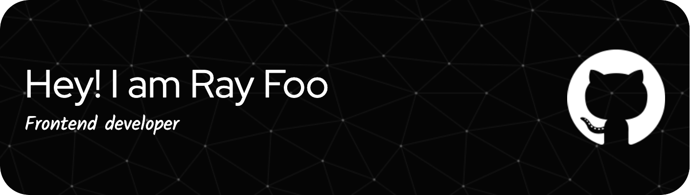

# 💫About Me :
🌱 I’m currently learning React, NextJS, React Native, Graphql

## 🌐Socials
 

# 💻Tech Stack
              
# 📊GitHub Stats :
 
 

---

  ## 💰You can help me by Donating
   

  <!-- Proudly created with GPRM ( https://gprm.itsvg.in ) -->
  
